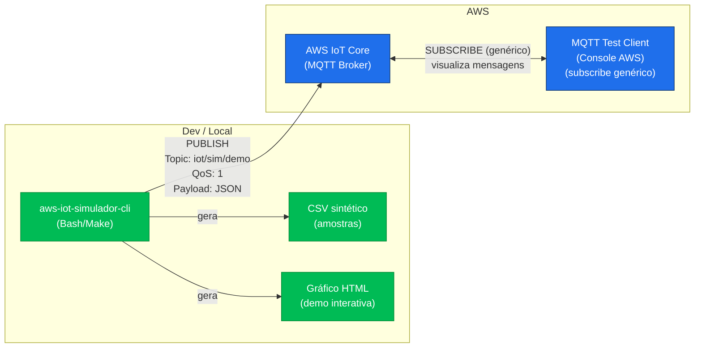
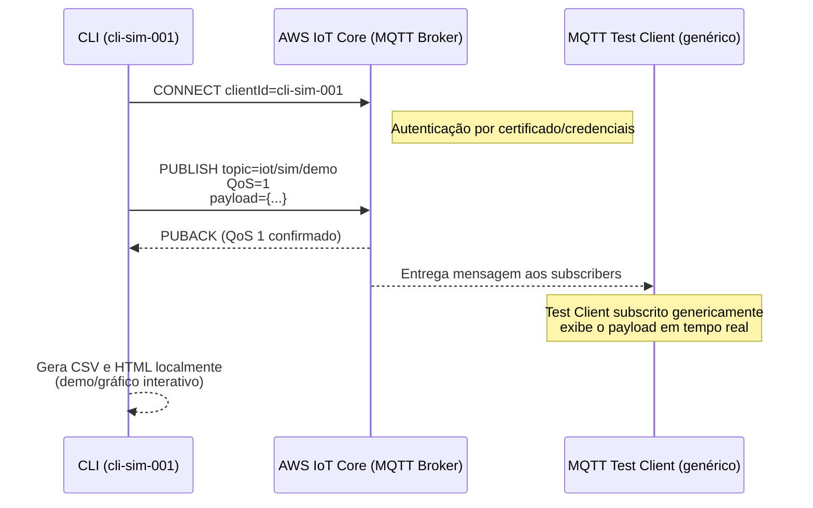

# aws-iot-simulador-cli


## Simulação de dispositivo IoT no AWS CloudShell/CLI com MQTT

## Demonstração (HTML interativo)

Abra pelo GitHub Pages:
- https://luiz-star.github.io/aws-iot-simulador-cli/assets/demo-gif-sintetico.html

<p>
  <a href="https://luiz-star.github.io/aws-iot-simulador-cli/assets/demo-gif-sintetico.html">
    ▶️ Abrir demonstração interativa
  </a>
</p>

** Página interativa que reproduz o fluxo de mensagens IoT (CLI → tópico MQTT), exibindo logs e mensagens em tempo real e oferecendo exportação em GIF/PNG da demonstração.


Opcional: GIF estático para visualização rápida:
<p align="center">
  
</p>

## Status e Projeto

[](https://github.com/luiz-star/aws-iot-simulador-cli/actions)
[](LICENSE)

- Project (kanban/roadmap): https://github.com/users/luiz-star/projects
- View deste projeto: adicione aqui a URL direta do board (Portfólio IoT — Roadmap)

  ## Destaques concluídos

- CI: Shellcheck para scripts Bash, com artefatos de relatório e badges no README.
- README: seção “Como rodar” e “Pré-requisitos” com comandos copy-paste.
- make demo: geração de CSV sintético e gráfico HTML interativo em assets/.
- Diagrama Mermaid do fluxo IoT (CLI → AWS IoT Core → MQTT Test Client).
- Demo interativa publicada no GitHub Pages (HTML autônomo).
  

## Este repositório demonstra:
- Criação de um Thing no AWS IoT Core (opcional para o lab)
- Publicação de leituras de sensores via AWS CLI (no CloudShell)
- Visualização em tempo real no Cliente de Teste MQTT
- Automação com scripts Bash
- Geração/visualização de gráfico (PNG e HTML interativo)
  



## Links rápidos
- Guia detalhado: [docs/guia-lab.md](docs/guia-lab.md)
- Diagrama: [docs/diagrama-aws-iot.png](docs/diagrama-aws-iot.png)
- Scripts: [src/scripts/publish-once.sh](src/scripts/publish-once.sh) | [src/scripts/publish-loop.sh](src/scripts/publish-loop.sh)
- CSV e gráfico: [assets/grafico-exemplo.csv](assets/grafico-exemplo.csv) | [assets/grafico-linhas.png](assets/grafico-linhas.png)
- Gráfico interativo (HTML): [assets/grafico-linhas.html](assets/grafico-linhas.html)
  - Abrir diretamente (Raw): https://raw.githubusercontent.com/luiz-star/aws-iot-simulador-cli/main/assets/grafico-linhas.html

## Sumário
- Arquitetura
- Pré-requisitos
- Guia rápido (5 min)
- Scripts e personalização
- Dados e gráfico
- GitHub Pages (opcional)
- Estrutura do repositório
- Troubleshooting
- Limpeza
- Licença

## Arquitetura

CloudShell / AWS CLI  → (publish iot/sensor) →  AWS IoT Core (MQTT)  ← (subscribe iot/sensor) ←  Cliente de Teste MQTT

- O CloudShell publica leituras simuladas no tópico MQTT (padrão: `iot/sensor`).
- O Cliente de Teste MQTT, no console do AWS IoT Core, assina o tópico e exibe as mensagens.

## Pré-requisitos

- Conta AWS com acesso ao AWS IoT Core e ao AWS CloudShell
- AWS CLI v2 (o CloudShell já possui)
- Permissão `iot:Publish` no tópico configurado
- Mesma região em CloudShell e IoT Core (ex.: `us-east-1`)



## Guia rápido (5 min)

1) Criar Thing (opcional para o lab)
- AWS IoT Core → Gerenciar → Coisas → Criar coisas
- Criar uma coisa única → Nome: `SimuladorCLI` → concluir sem certificados (para este lab)

2) Assinar o tópico no Cliente de Teste
- AWS IoT Core → Testar → Cliente de teste MQTT
- Assine o tópico: `iot/sensor`

3) CloudShell: clonar e executar
```bash
git clone https://github.com/luiz-star/aws-iot-simulador-cli.git
cd aws-iot-simulador-cli
chmod +x src/scripts/*.sh

# Envio único
bash src/scripts/publish-once.sh

# Envio contínuo (loop)
bash src/scripts/publish-loop.sh

4) Ver mensagens chegando
O Cliente de Teste MQTT mostrará JSON com temperatura, umidade, timestamp e iteração.
Exemplo de payload:

{
  "iteracao": 3,
  "temperatura": 27.1,
  "umidade": 52.9,
  "timestamp": "2025-01-01T12:00:00Z"
}

Scripts e personalização
Scripts principais

Envio único: src/scripts/publish-once.sh
Envio contínuo: src/scripts/publish-loop.sh
Variáveis de ambiente (opcionais)

export AWS_REGION=us-east-1   # região AWS
export TOPIC=iot/sensor       # tópico MQTT
export COUNT=5                # qtde de leituras (loop)
export SLEEP=2                # intervalo em segundos (loop)
export TEMP_BASE=25           # base da temperatura
export UMI_BASE=50            # base da umidade

Exemplos
# Publicar em outro tópico
TOPIC="iot/sensor/dev" bash src/scripts/publish-once.sh

# 10 leituras com 1s de intervalo
COUNT=10 SLEEP=1 bash src/scripts/publish-loop.sh

Dica de região

aws configure set region us-east-1

Dados e gráfico
Arquivos

CSV: assets/grafico-exemplo.csv
PNG do gráfico: assets/grafico-linhas.png
HTML interativo: assets/grafico-linhas.html
Para abrir o HTML diretamente via navegador use a URL Raw:
https://raw.githubusercontent.com/luiz-star/aws-iot-simulador-cli/main/assets/grafico-linhas.html
Observação: páginas com /blob/main/ não executam HTML; use “Raw” ou GitHub Pages.

Gerar PNG com gnuplot

gnuplot -e "set term png size 900,500; \
set output 'assets/grafico-linhas.png'; \
set datafile separator ','; \
set key left top; set grid; \
set title 'Leituras simuladas'; \
set xlabel 'Iteração'; set ylabel 'Valor'; \
plot 'assets/grafico-exemplo.csv' using 1:2 with linespoints title 'Temperatura', \
     'assets/grafico-exemplo.csv' using 1:3 with linespoints title 'Umidade';"

# Estrutura do repositório

aws-iot-simulador-cli/
├─ assets/
│  ├─ grafico-exemplo.csv
│  ├─ grafico-linhas.png
│  ├─ grafico-linhas.html
│  └─ tabela-parametros.md
├─ docs/
│  ├─ guia-lab.md
│  └─ diagrama-aws-iot.png
├─ src/
│  └─ scripts/
│     ├─ publish-once.sh
│     └─ publish-loop.sh
├─ .gitignore
├─ LICENSE
└─ README.md

# Troubleshooting

* Nada aparece no Cliente de Teste MQTT
* Verifique se o tópico assinado é o mesmo de TOPIC.
* Confirme a região (aws configure get region) e ajuste se necessário.
* Cheque permissões: a identidade do CloudShell precisa de iot:Publish no tópico.
* HTML não abre no GitHub
* Use a URL “Raw” ou publique via GitHub Pages (seção acima).
* Mensagens não saem do CloudShell
* Rode aws sts get-caller-identity para confirmar credenciais válidas.
* Teste publicar manualmente: aws iot-data publish --topic iot/sensor --payload '{}'.

# Limpeza
* AWS IoT Core → Gerenciar → Coisas → selecione SimuladorCLI → Excluir
* Remova assinaturas no Cliente de Teste MQTT, se desejar

# Licença
Este projeto está licenciado sob a Apache-2.0. Consulte LICENSE.
